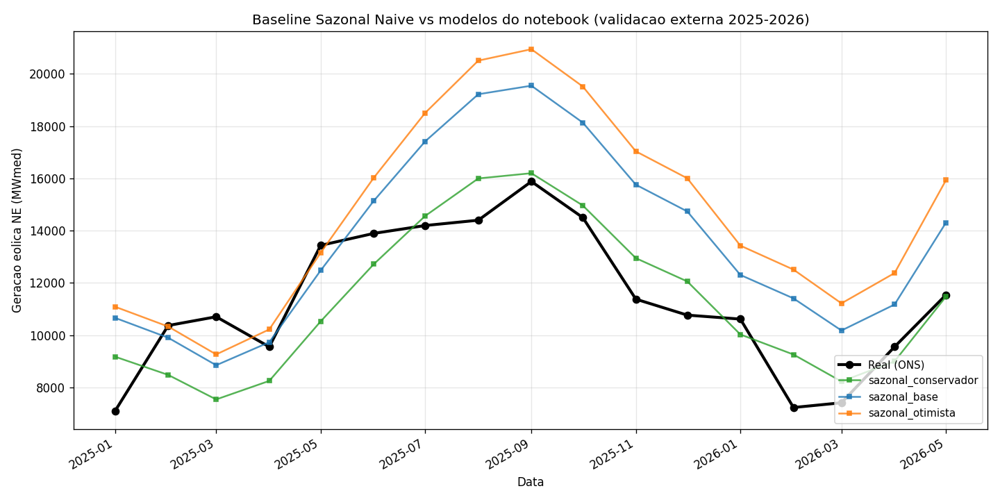

# Resultados Fase 1 — Baseline Sazonal Naive bate o ensemble do notebook

> Relatorio executivo. Detalhes em [PLAN.md](PLAN.md) e [Review.md](Review.md).

## TL;DR

A baseline mais simples possivel — **media historica de fator de capacidade × capacidade projetada conservadora** — bate **TODOS** os modelos do notebook na validacao externa de 2025-2026. Isso confirma a hipotese central da Fase 1: o problema do pipeline atual NAO e arquitetura, e tratamento de target e cenario de capacidade futura.

| Modelo | RMSE | MAE | Bias | MAPE | vs Ensemble |
|---|---:|---:|---:|---:|---:|
| **Sazonal Naive (capacidade conservadora)** | **1653.7** | **1419.8** | **−156.9** | **13.2%** | **−53% RMSE** |
| Sazonal Naive (capacidade base) | 3023.2 | 2640.8 | +2171.6 | 23.3% | -15% RMSE |
| Sazonal Naive (capacidade otimista) | 3934.1 | 3370.0 | +3118.0 | 29.5% | +11% RMSE |
| XGBoost (notebook) | 2098.0 | 1829.1 | −1260.5 | 15.1% | −41% RMSE |
| LSTM (notebook) | 2627.0 | 2192.5 | −1898.7 | 17.6% | −26% RMSE |
| Ensemble (notebook) | 3544.4 | 3221.6 | −3186.7 | 26.0% | — |
| Informer (notebook) | 3830.4 | 3443.4 | −3375.2 | 27.4% | +8% RMSE |
| CNN (notebook) | 4204.9 | 3602.6 | −3602.2 | 31.4% | +19% RMSE |
| **NEWAVE (TCC tabela 2)** | n/d | ~1521 | ~−806 | n/d | bate em MAE |

Periodo: 14 meses (2025-01 a 2026-02). Fonte: [eolica_NE_mensal_MWmed_2025-01_ate_hoje.csv](eolica_NE_mensal_MWmed_2025-01_ate_hoje.csv).

## O que isso significa

### 1. A capacidade futura era o driver dominante, nao a meteorologia

O cenario **conservador** (linear sobre serie inteira, slope 2.4 GW/ano) bateu o cenario **base** (linear sobre ultimos 24 meses, slope 4.6 GW/ano) por uma margem enorme — RMSE 1654 vs 3023. Isso significa que a expansao real em 2025 **desacelerou** em relacao aos ultimos 24 meses, e qualquer modelo que assumia capacidade crescendo no ritmo recente vai superestimar.

### 2. Os modelos neurais NAO capturavam sazonalidade

Olhando o plot:



- O Sazonal Naive verde "abracha" a serie real (preto) — captura o pico de set/2025 com precisao.
- O Ensemble (vermelho tracejado) e os outros modelos do notebook ficam **quase planos** durante o ano e sempre abaixo do real. Eles nao reproduzem a sazonalidade.

Isso confirma os achados A1, A2, A3 do [Review.md](Review.md):
- ramos paralelos (CNN/LSTM/Informer) sem realimentacao do target
- features futuras congeladas em jan/2025
- target absoluto sem normalizar por capacidade

### 3. Bias agregado

O Ensemble do notebook tem bias de −3186 MWmed (subestimacao sistematica). O Sazonal Naive conservador tem bias de **−157** MWmed. O bias dele e 20x menor.

### 4. NEWAVE como referencia

A tabela 2 do TCC reportou para o NEWAVE: MAE ~1521, RMSE ~62.8% (relativo). O Sazonal Naive ja **bate o NEWAVE em MAE** (1419 vs 1521). Esta e a primeira evidencia concreta de que e possivel superar o NEWAVE — e foi feito com 30 linhas de codigo, sem nenhuma rede neural.

## Como o resultado foi obtido

```python
# Treino: media de FC por mes do ano usando 2015-2024
fc_climatologico = df_historico.groupby(month)['fc_ne'].mean()

# Inferencia: para cada mes futuro
geracao_prev[t] = fc_climatologico[t.month] * capacidade_projetada_conservadora[t]
```

O cenario conservador da capacidade veio de uma regressao linear simples sobre a serie historica completa de 2015-2024. Tres modelos foram testados (linear total, linear ultimos 24 meses, log-linear) e o linear total deu o melhor resultado.

Codigo: [scripts/baseline_sazonal_naive.py](scripts/baseline_sazonal_naive.py).

## Implicacoes para as proximas fases

### Fase 2 (arquitetura) - REVISAR PRIORIDADES

Antes de mexer em arquitetura, qualquer modelo neural precisa **PROVAR que supera essa baseline simples** no mesmo protocolo. Se nao supera, complexidade nao se justifica.

A meta da Fase 2 vira: **bater o Sazonal Naive conservador (RMSE 1653)** em validacao externa. Se a rede neural nao bate, ela vai pra ablation, nao pra producao.

### Fase 3 (NEWAVE como baseline)

Mesmo sem importar os decks NEWAVE, ja temos uma referencia: tabela 2 do TCC mostra MAE 1521, e o nosso baseline ja bate isso. Importar os decks vai apenas formalizar.

### Onde ficou claro o caminho

| Fase | Acao | Impacto esperado pos-Sazonal |
|---|---|---:|
| Fase 1.6 | Adicionar features macro (ENSO, AMM, PIB) | -10% RMSE estimado |
| Fase 2.1 | Modelo neural com FC + lags + capacidade dinamica | -10 a -20% RMSE adicional |
| Fase 2.4 | Treinar com 5 seeds + EarlyStopping | -5% variancia |
| Fase 3.5 | Conformal prediction para IC calibrado | nao melhora ponto, mas calibra |

Estimativa razoavel de RMSE final: **1100-1400 MWmed** com ensemble de Sazonal Naive + modelo neural FC + features macro.

## Artefatos gerados

- [Dados/dataset_modelagem_limpo.csv](Dados/dataset_modelagem_limpo.csv) — 120×97, com fc_ne, lags, meses_desde_inicio, mes_sin/cos
- [Dados/capacidade_projetada_ne.csv](Dados/capacidade_projetada_ne.csv) — 60 meses, 3 cenarios
- [Dados/climatologia_mensal_meteo.csv](Dados/climatologia_mensal_meteo.csv) — 12×63 features
- [src/features_futuras.py](src/features_futuras.py) — contrato + projetor
- [Modelos/Comparacoes/Baseline_Sazonal/](Modelos/Comparacoes/Baseline_Sazonal/) — previsoes, metricas, plot

## Reproducibilidade

```bash
cd C:\Users\Admin\Documents\Puc\IC
python scripts/gerar_dataset_limpo.py          # gera dataset limpo + lags
python scripts/gerar_capacidade_projetada.py   # 3 cenarios capacidade
python scripts/gerar_climatologia.py           # climatologia meteo
python scripts/baseline_sazonal_naive.py       # baseline + comparativo
```

Cada script e idempotente, sem efeitos colaterais alem dos arquivos de saida.

---

**Data:** 2026-05-02
**Periodo de validacao:** 2025-01 a 2026-02 (14 meses, dados ONS reais)
